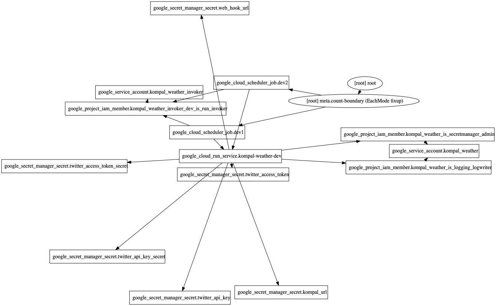

# KompalWeather

## What is KompalWeather?

KompalWeather reports on how crowded kompal-yu is on Twitter ([@KompalWeather](https://twitter.com/KompalWeather)) and Slack. 

[Kompal-yu （金春湯）](https://kom-pal.com/) is one of the best saunas and public baths in Osaki. They are disclosing how crowded it is on their site. Furthermore, they provide API. KompalWeather utilizes this API.

Take advantage of kompal weather to optimize your sauna experience!

## Features

### Existing

* Notification about the state of congestion on
  * Twitter [@KompalWeather](https://twitter.com/KompalWeather)
  * Slack channel via incoming webhook
* Record data in out Google Sheets every 15 minutes during business hours

### Plan

* Visualization of weekly congestion

If you have a feature request, please make an issue from [here](https://github.com/toshi0607/KompalWeather/issues/new)!

## Architecture

### Cloud

* Cloud Run
* Cloud Scheduler
* Secret Manager
* Cloud Build

Managed by [Terraform](https://github.com/toshi0607/KompalWeather/tree/master/terraform/development)
