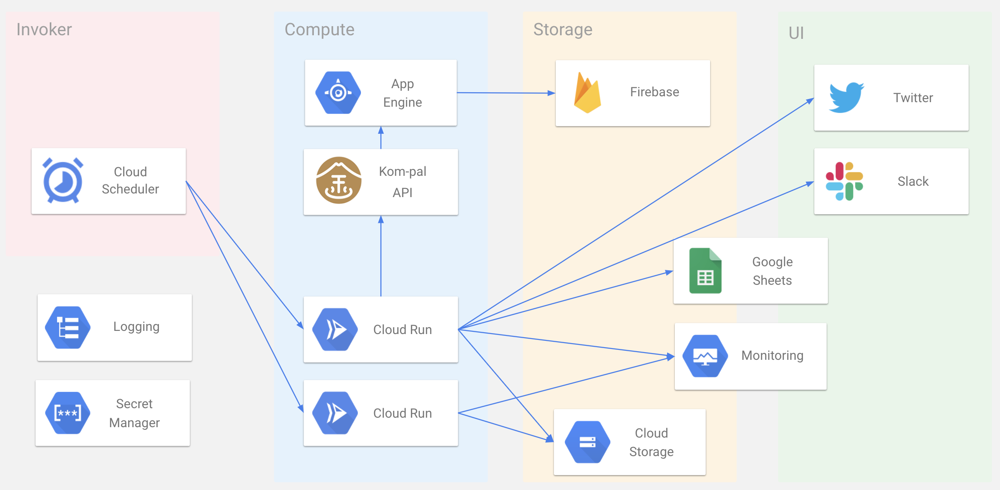

# KompalWeather

## What is KompalWeather?

KompalWeather reports on how crowded kompal-yu is on Twitter ([@KompalWeather](https://twitter.com/KompalWeather)) and Slack. 

[Kompal-yu （金春湯）](https://kom-pal.com/) is one of the best saunas and public baths in Osaki. They are disclosing how crowded it is on their site. Furthermore, they provide API. KompalWeather utilizes this API.

Take advantage of kompal weather to optimize your sauna experience!

## Features

### Existing

* Notification about the state change of congestion on
  * Twitter [@KompalWeather](https://twitter.com/KompalWeather)
  * Slack channel via incoming webhook
* Post a congestion trend for the same day last week at 15:00 on every business day
* Post a congestion trend for the last week on every Tuesday
* Record data in Google Sheets every 15 minutes during business hours

### Plan

* Trend dashboard

If you have a feature request, please make an issue from [here](https://github.com/toshi0607/KompalWeather/issues/new)!

## Architecture

### Cloud

* Cloud Run
* Cloud Scheduler
* Cloud Monitoring
* Cloud Logging
* Secret Manager
* Cloud Build
* Cloud Storage

### Dependency

Managed by [Terraform](https://github.com/toshi0607/KompalWeather/tree/master/terraform/development)
